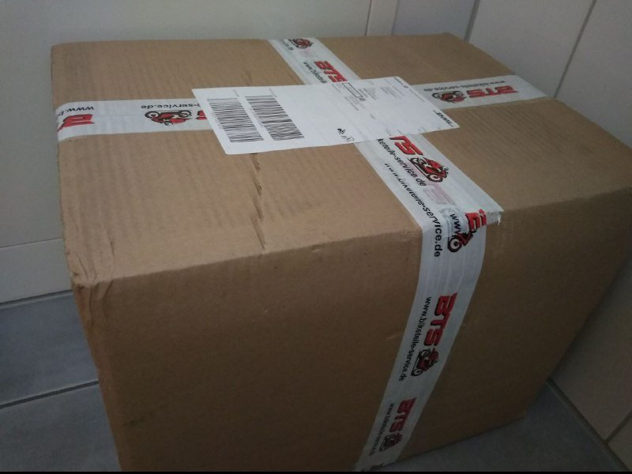

Title: Fitness and Parts
Date: 2018-09-24 18:40
Category: motorbike
Tags: rally, motorbike, fitness
Slug: fitnessnparts
Authors: choutos

 [English Version](#and-the-training-started)

---

###O treino começou
Pode soar fácil mas levo tentando fazer exercício bem cedo, antes de ir trabalhar, durante umha boa tempada. Por suposto falhei miseravelmente cada manhã. Sabedes que figem em vez disso? Premer o botão de adiar o despertador várias vezes. Bem pensado é um bom exercício para as costas, braços e ombros. Cada semana alterno o lado da cama, a simetria é tudo.

Mas pelo menos comecei! Sem tempo livre com trabalho, estudos e a fazendo o que posso para criar umha meninha de 3 anos; a minha única opção era erguer-me antes das 6am e fazer algúm exercício. Foi só o primeiro dia mas semelha funcionar bem para mim. Apesar de ter algo de sono enquanto escrevo isto, sinto-me com mais energia e incluso fui quem de rematar as tarefas desta semana do curso de Bioinformática que estou a fazer. Além disso estou tamém a aprender a programar em OCaml, preparar toda a logística para a carreira, arranjar a mota... e ter umha vida.

### Bike goodies arrived
Sempre sabe bem abrir umha caixa com cousas para a mota, incluso se é só um elevador e algumhas peças de reposição.

Já só preciso de arranjar tempo para trabalhar na "besta"... e aprender onde encaixa cada peça. Mas para isso está o Internet, não é?

  
 
 
 
--- 

###And the training started
It may sound easy, but I've been trying to wake up and work out early in the morning, before going to work, for quite a while. I failed miserably every morning, of course. You know what I did instead? Hit the snooze button multiple times. It's a good exercise for your back, arms and shoulders. Every week I rotate sides of the bed, because it's all about symmetry.

But at least I started! Busy as hell with work, studies and doing my best to raise a 3 years old girl; my only option was to wake up before 6am and do some exercise. It's been only the first day but it seems to work pretty well for me. Despite being a bit sleepy while writing this, I feel more energetic and I was even able to finish this week's assigments for a Bioinformatics course I enrolled to. On top of that I am also trying to learn some OCaml programming, preparing all the logistics for the race, fixing the bike... and having a life.

### Bike goodies arrived
It always feels nice to open a box with stuff for your bike, even if it is only a lift stand and some spare parts.

I only need to find time to work on the "beast"... and learn where each bit fits. But we have internet for that, right?
 

 [Versão em Galego](#o-treino-comecou)
 
 