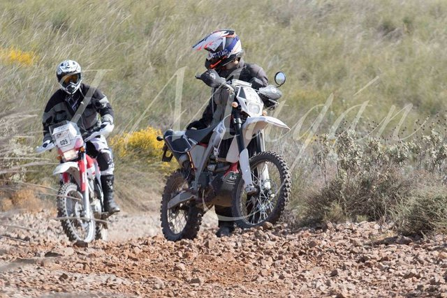

Title: From Zero to... Something
Date: 2018-09-23 14:00
Category: motorbike
Tags: rally, motorbike, ajp
Slug: zero2something
Authors: choutos

This is not a story about podiums, best times or struggles for seconds that win championships. This is the story about the average guy with an office work, a family and a passion for motorbikes. A person fighting to improve himself. A person who sometimes has fun suffering and sometimes doesn't have fun suffering. Suffering is the only constant in this sport.

    I am the one lifting the bike

A few years have passed since I decided to participate in a rally. During this time I did some adventure trips, a couple of enduro trainings with professional riders and even a 2 days amateur rally back in 2016. But the dream of a proper (but still amateur) navigation rally is still pending.

Today I am starting this site as a journal for my journey. Where I hope to go from **total beginner to rally racing** in 2019, ideally without killing myself. The main and only goal is to finish the race in one piece, but at the same time I will improve my fitness, learn how to properly ride a dirt bike and learn some mechanichs.

